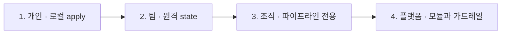

# 50장 — 프로덕션 운영 종합: 가드레일 · 표준 · 비용 · 보안

**이 장에서 배우는 것**

- 조직의 Terraform 성숙도를 네 단계로 진단하고, 지금 단계의 병목과 다음 단계에 도입할 것을 지목할 수 있다.
- 가드레일을 코드·provider·AWS 세 층으로 설계하고 각 층이 어떤 종류의 실패를 잡는지 구분할 수 있다.
- 파이프라인 롤과 사람 롤, plan 전용과 apply 전용을 분리해 권한을 설계할 수 있다.
- Terraform이 만든 것의 비용을 추적하고, 비용이 큰 패턴과 삭제되지 않고 남는 것들을 알아본다.
- state 손상·오삭제·계정 오배포 같은 사고에서 첫 30분에 무엇을 할지 정해 둔 대응서를 쓸 수 있다.
- 운영 지표 다섯 가지를 정의해 개선이 실제로 일어났는지 숫자로 확인할 수 있다.

**왜 중요한가**

인프라 코드가 실패하는 방식은 대개 문법이 아니다. 어떤 팀은 스테이징 디렉터리에서 프로덕션 프로파일이 활성화된 채로 `apply`를 눌러 프로덕션 RDS를 교체했다. 어떤 팀은 모듈 없이 각자 복사한 코드로 6개월을 달린 뒤, NAT 게이트웨이가 계정에 27개 있고 그중 19개가 어떤 코드에서도 참조되지 않는다는 사실을 청구서로 알게 됐다. 어떤 팀은 lock이 걸린 채 러너가 죽어 세 시간 동안 아무도 apply하지 못했고, 조급해진 누군가 `force-unlock`을 두 번 눌러 state를 반쯤 덮어썼다.

셋 다 개인의 실수가 아니라 **조직 설계의 공백**이다. 첫 번째는 provider 계층 가드레일 한 줄로 막힌다. 두 번째는 태그 기반 비용 할당과 drift 탐지가 없어서 생겼다. 세 번째는 사고 대응서가 없어서 사람이 즉흥적으로 판단했기 때문이다. 숙련도를 올리는 것으로는 셋 중 어느 것도 예방되지 않는다 — 숙련자도 금요일 저녁에는 틀린다.

이 장은 교재의 결론이다. 도구는 이미 다 나왔다 — `default_tags`([10장](../level1-beginner/10-tags-basics.md)), `prevent_destroy`([21장](../level2-intermediate/21-lifecycle-meta-arguments.md)), `allowed_account_ids`([25장](../level2-intermediate/25-multi-account.md)), 원격 state와 잠금([16장](../level2-intermediate/16-remote-state-and-backends.md)), 파이프라인([38장](38-large-scale-structure-cicd.md)), drift 탐지([36장](36-drift-refresh-and-checks.md)). 여기서 하는 일은 그것들을 **하나의 운영 설계로 배치하는 것**이다.

## 성숙도 모델: 지금 어느 단계인가

조직은 대체로 같은 순서로 성장한다. 각 단계에는 고유한 병목이 있고, 병목을 해소하는 도입물이 다음 단계를 연다.



**1단계 — 개인이 로컬에서 apply한다.** state가 노트북에 있고 자격증명은 장기 액세스 키다. 병목은 **두 번째 사람**이다 — 동시에 apply하면 state가 갈라지고 한 사람이 휴가를 가면 아무도 못 고친다. 도입할 것은 원격 백엔드와 잠금, 코드 저장소다. 이 단계에서 모듈부터 만들려는 시도는 대개 실패한다 — 재사용할 사례가 아직 둘도 없다.

**2단계 — 팀이 원격 state로 협업한다.** 코드는 저장소에 있고 PR로 리뷰하지만 apply는 여전히 노트북에서 나간다. 병목은 **감사 불가능성**이다 — 리뷰를 통과한 코드와 실제 apply된 코드가 같다는 보장이 없다. 사람마다 프로덕션 권한을 갖고 있는 것도 병목이다. 도입할 것은 **CI에서의 `plan`과 게이트가 있는 `apply`**, `plan -out`으로 저장한 계획의 승인이다([38장](38-large-scale-structure-cicd.md)).

**3단계 — 조직이 파이프라인으로만 배포한다.** 병목은 **표준의 부재**다 — 팀이 다섯이면 VPC 만드는 방식이 다섯 가지고 태그 키가 `Env`·`env`·`Environment`로 갈리며 provider 버전이 스택마다 다르다. 도입할 것은 **모듈 레지스트리와 정책 게이트**, 태깅 표준이다.

**4단계 — 플랫폼 팀이 모듈과 가드레일을 제공한다.** 병목은 **플랫폼 팀 자신**이다 — 모든 변경이 그 큐를 거치면 앱 팀은 우회로를 만든다(콘솔, 별도 계정, `-target`). 도입할 것은 **에스컬레이션 경로가 있는 예외 처리**와 모듈의 확장점(`tags` 병합, `extra_*` 인수)이다([49장](49-design-decisions.md)).

진단은 간단하다. **"지금 프로덕션에 apply할 수 있는 사람이 몇 명인가"**와 **"그 apply가 코드 리뷰를 거쳤다는 증거가 어디에 남는가"** 두 질문의 답이 단계를 정한다. 그리고 단계를 건너뛰지 않는다 — 원격 state 없이 정책 게이트를 만들면 게이트를 우회하는 로컬 apply가 정상 경로가 된다.

## 가드레일 3층: 각 층이 잡는 실패가 다르다

가드레일을 한 층에만 두면 반드시 샌다. 세 층은 서로 다른 시점, 서로 다른 종류의 실패를 잡는다.

| 층 | 언제 막는가 | 잡는 실패 | 못 잡는 것 |
|---|---|---|---|
| 코드 계층 | PR / plan 전 | 표준 위반, 위험한 설정, 승인 안 된 리소스 | 코드를 거치지 않은 변경 |
| provider 계층 | plan / apply 중 | 잘못된 계정, 태그 누락, 보호 리소스 삭제 | provider를 거치지 않은 변경 |
| AWS 계층 | API 호출 시점 | 콘솔·CLI·다른 도구를 포함한 모든 경로 | 허용된 범위 안의 잘못된 값 |

핵심은 **아래로 갈수록 우회가 어렵고, 위로 갈수록 메시지가 친절하다**는 것이다. 코드 계층은 "이 시큐리티 그룹은 SSH를 전 세계에 열고 있다"고 사람에게 말해 준다. AWS 계층은 `AccessDenied`만 던진다. 그래서 **같은 규칙을 두 층에 둔다** — 위층은 가르치고 아래층은 막는다.

### 1층: 코드 계층

- **모듈 강제.** "VPC는 사내 `platform/vpc`를 쓴다" 같은 규칙은 리뷰어의 기억이 아니라 검사로 표현한다. plan JSON이 아니라 **설정 자체**를 보는 검사가 필요하므로 `grep` 수준의 규칙(루트 모듈에 `resource "aws_vpc"`가 직접 있으면 거부)으로 시작해도 충분하다.
- **정적 분석.** `tflint`는 존재하지 않는 인스턴스 타입이나 deprecated 인수 같은 provider 특유의 실수를, `checkov`·`tfsec` 계열은 보안 규칙 세트를 준다. 둘 다 **오탐이 많으므로** 규칙 세트를 조직에 맞게 잘라내는 작업이 도입의 절반이다.
- **정책 코드.** OPA/Conftest와 Sentinel은 plan JSON에 규칙을 적용한다([38장](38-large-scale-structure-cicd.md)). 코드가 아니라 **계획된 변경**을 보므로 "prod 스택에서 `delete` 액션 금지" 같은 규칙을 쓸 수 있다. 도입 순서는 경고 → 위반 0 → 차단이다.
- **PR 체크리스트.** 자동화되지 않는 판단이 남는다. 짧아야 쓰인다.

```markdown
- [ ] plan 출력을 첨부했고 `destroy`/`replace`가 0건이거나 사유가 적혀 있다
- [ ] 새 리소스에 조직 필수 태그가 붙는다 (모듈을 썼다면 자동)
- [ ] state를 이동시키는 변경이면 `moved` 블록이 있다
- [ ] provider·모듈 버전을 올렸다면 CHANGELOG의 Breaking Change/Note를 확인했다
```

### 2층: provider 계층

provider 자체가 제공하는 가드레일은 설정 몇 줄이고 우회하려면 코드를 고쳐야 하므로 비용 대비 효과가 가장 크다.

```terraform
provider "aws" {
  region              = "ap-northeast-2"
  allowed_account_ids = ["222222222222"]

  default_tags {
    tags = {
      Environment = "prod"
      Owner       = "platform"
      ManagedBy   = "terraform"
    }
  }

  tag_policy_compliance = "error"
}
```

- **`allowed_account_ids` / `forbidden_account_ids`** — 실수로 다른 계정을 쓰는 것을 막는다. **서로 충돌**하므로 하나만 쓴다. 스택 디렉터리마다 계정 ID를 박아 두면 프로파일이 새어 들어오는 사고가 원천 차단된다. 대가는 권한이다 — provider가 실제 계정 ID를 알아내야 하므로 `sts:GetCallerIdentity`(또는 `iam:GetUser`/`iam:ListRoles`) 호출이 추가로 필요하다([25장](../level2-intermediate/25-multi-account.md)).
- **`default_tags`** — 태그를 잊는 실수를 구조적으로 없앤다. 비용 할당·소유자 추적·정리 자동화가 전부 여기 의존한다. **`aws_autoscaling_group`은 예외**라는 점만 기억한다([10장](../level1-beginner/10-tags-basics.md), [23장](../level2-intermediate/23-tagging-strategy.md)).
- **`tag_policy_compliance`** — 조직 태그 정책의 필수 태그 키를 provider가 검사한다. 값은 `error`·`warning`·`disabled`이고 설정하지 않으면 검사하지 않는다. 환경변수 `TF_AWS_TAG_POLICY_COMPLIANCE`로도 지정한다. 전제가 둘 있다 — **계정에 태그 정책이 붙어 있어야 하고**, **Terraform을 실행하는 주체에 `ListRequiredTags` IAM 권한이 있어야 한다.** 이 API는 2025년 11월에 나왔으므로 기존 파이프라인 롤의 권한을 손봐야 할 수 있다. 도입은 `warning`으로 시작해 `error`로 올린다.
- **`prevent_destroy`** — 데이터가 있는 리소스에 건다. RDS 인스턴스, S3 버킷, DynamoDB 테이블처럼 재생성이 곧 데이터 손실인 것들이다. 한계도 분명하다 — 리소스를 코드에서 지우면 이 보호도 함께 지워진다. 그래서 3층이 필요하다.

### 3층: AWS 계층

Terraform을 거치지 않는 경로까지 덮는 유일한 층이다.

- **SCP(Service Control Policy)** — 조직 단위로 API 자체를 금지한다. 값어치가 큰 것들: 승인되지 않은 리전 차단, 루트 사용자 액세스 키 생성 차단, CloudTrail·Config 비활성화 차단, 태그 없는 리소스 생성 차단(`aws:RequestTag` 조건). SCP는 **허용이 아니라 상한**이다 — SCP가 허용해도 IAM이 막으면 못 한다.
- **IAM 권한 경계(permission boundary)** — 파이프라인 롤이 자기보다 강한 롤을 만드는 것을 막는다. Terraform이 IAM 리소스를 만든다면 사실상 필수다. `aws_iam_role`의 `permissions_boundary` 인수로 강제하고, 이를 요구하는 SCP를 함께 둔다.
- **태그 정책** — 조직 관리 계정에서 정의하며 `aws_organizations_policy`와 `aws_organizations_policy_attachment`로 코드화한다. provider의 `tag_policy_compliance`는 이 정책을 **plan 시점에 미리** 검사하는 것이고 강제 자체는 AWS 쪽 기능이다.
- **AWS Config 규칙** — 사후 탐지다. 암호화되지 않은 볼륨, 퍼블릭 버킷, 태그 없는 리소스를 **이미 존재하는 것들까지** 훑는다. "새로 만드는 건 막고 이미 있는 건 목록으로 뽑는" 짝이 된다.

## 권한 설계: 파이프라인과 사람을 나눈다

원칙은 하나다. **사람은 읽고, 파이프라인은 쓴다.**

- **사람용 읽기 롤** — 프로덕션 계정에 `ReadOnlyAccess` 수준. 여기에 state 읽기 권한을 줄지는 신중히 정한다. state에는 시크릿이 들어 있다([16장](../level2-intermediate/16-remote-state-and-backends.md), [26장](../level2-intermediate/26-secrets-and-ephemeral.md)).
- **plan 전용 롤** — CI의 PR 단계가 쓴다. AWS 쪽은 읽기 권한, state는 `s3:GetObject`만. 잠금을 못 잡으므로 `-lock=false`가 필요해지지만 plan 전용 롤이 state를 망가뜨릴 경로가 사라진다.
- **apply 롤** — 병합 후 단계만 쓴다. state 읽기·쓰기·잠금과 실제 리소스 조작 권한을 갖는다. 이 롤을 assume할 수 있는 주체는 **파이프라인의 특정 워크플로**로 좁힌다(OIDC의 `sub` 조건에 저장소·브랜치·환경을 넣는다).
- **비상 롤(break-glass)** — 파이프라인이 죽었을 때 사람이 쓸 수 있는 강한 롤. **존재하되 사용이 시끄러워야 한다** — 사용 시 알림, MFA 필수, 세션 시간 짧게, CloudTrail 알람. 이 롤이 없으면 사고 때 사람들이 루트 사용자를 꺼내 든다.

계정 분리는 권한 설계를 단순하게 만든다. 환경이 계정으로 갈려 있으면 "prod 리소스만 만질 수 있는 정책"을 쓸 필요가 없다 — 계정 자체가 경계다([25장](../level2-intermediate/25-multi-account.md)).

**부트스트랩 권한**은 별도로 설계한다. state 버킷을 만들 state는 어디에 두는가. 실무적인 답은 셋이다. (1) 부트스트랩 스택만 로컬 state로 만들고 그 state 파일을 자신이 만든 버킷으로 옮긴다. (2) 부트스트랩 스택의 state를 별도의 "관리" 계정 버킷에 둔다. (3) 부트스트랩만 코드가 아닌 스크립트로 처리한다. 어느 쪽이든 **부트스트랩 롤은 강력하므로 사용 빈도가 낮고 감사가 강해야 한다.**

## 비용: 만든 것의 값을 추적한다

**태그 기반 할당이 전제다.** Cost Explorer에서 태그로 비용을 쪼개려면 그 태그가 **비용 할당 태그로 활성화**되어 있어야 하고 활성화 이전 기간은 소급되지 않는다. 그래서 태깅 표준은 빠를수록 좋다. 최소 넷을 권한다 — `Environment`, `Owner`(팀), `CostCenter`(청구 단위), `ManagedBy`. 마지막 것이 특히 쓸모 있다. **`ManagedBy=terraform`이 아닌 리소스 목록이 곧 "코드 밖에서 만들어진 것" 목록**이고, 이는 drift와 유령 비용의 주 원인이다.

**plan 기반 추정**은 사전에 작동한다. Infracost 같은 도구가 plan JSON을 읽어 월 비용 변화를 PR 코멘트로 붙인다([38장](38-large-scale-structure-cicd.md)). 값어치는 절대 금액이 아니라 **델타**에 있고, 추정은 정가 기준 근사이므로 Savings Plans·RI·데이터 전송량이 빠진다는 점을 명시해 둔다.

**비용이 큰 패턴**은 대개 코드에서 한 줄로 보인다.

- **NAT 게이트웨이** — AZ마다 하나씩 만드는 것이 가용성 모범이지만 3-AZ면 시간당 요금이 3배이고 데이터 처리 요금이 얹힌다. 비프로덕션은 하나로 줄이거나 VPC 엔드포인트로 트래픽을 뺀다.
- **Interface VPC 엔드포인트** — 엔드포인트마다, 그리고 **AZ마다** 시간당 요금이 붙는다. 서비스 10개 × 3 AZ면 30개다. S3·DynamoDB는 요금이 다른 Gateway 엔드포인트를 쓴다([27장](../level2-intermediate/27-vpc-networking.md)).
- **유휴 ALB/NLB** — 트래픽이 0이어도 시간당 요금이 있다. 스테이징에 남은 것, 이관 후 지우지 않은 것이 쌓인다.
- **Multi-AZ RDS와 오버프로비저닝** — Multi-AZ는 요금이 약 두 배다. 인스턴스 클래스는 처음 정한 값이 몇 년 가는 경향이 있으므로 주기적으로 재검토한다([31장](../level2-intermediate/31-databases-rds-dynamodb.md)).
- **로그 보존** — `aws_cloudwatch_log_group`의 `retention_in_days`를 지정하지 않으면 로그가 무기한 쌓인다([32장](../level2-intermediate/32-observability.md)).

**삭제되지 않고 남는 것들**이 두 번째 축이다. `terraform destroy`는 state에 있는 것만 지운다. 남는 것의 목록은 거의 정해져 있다 — **최종 스냅샷**(`skip_final_snapshot = false`로 만든 것은 클러스터가 사라져도 남는다), **EBS 스냅샷과 AMI**(이미지 파이프라인이 만든 것은 대개 Terraform 밖에 있다), **분리된 EBS 볼륨과 미할당 EIP**(EIP는 미사용 상태에서 과금된다), **Lambda가 자동 생성한 `/aws/lambda/<name>` 로그 그룹**(로그 그룹을 코드로 명시하면 사라지는 문제다), **버저닝 버킷의 이전 버전과 미완료 멀티파트 업로드**(수명 주기 규칙 없이는 계속 과금된다).

정리 작업은 사람의 기억이 아니라 **주기 작업**으로 만든다. 태그 기준으로 "만들어진 지 90일 넘고 `ManagedBy` 태그가 없는 것"을 뽑는 리포트를 월 1회 돌리는 것만으로도 대부분이 잡힌다.

## 보안: state · 자격증명 · 공급망

**state 접근은 곧 시크릿 접근이다.** 이 문장이 조직 보안의 출발점이다([16장](../level2-intermediate/16-remote-state-and-backends.md)). 조치는 넷이다 — **버킷 암호화와 환경별 KMS 키 분리**(버킷 정책이 잘못 열려도 `kms:Decrypt`가 두 번째 문이 된다), **버킷 정책과 퍼블릭 액세스 차단**(`aws:PrincipalOrgID` 조건), **버저닝과 삭제 권한 분리**(`s3:DeleteObjectVersion`을 파이프라인 롤에서 뺀다), **CloudTrail 데이터 이벤트로 읽기 감사**.

**애초에 state에 넣지 않는 것**이 더 나은 해법일 때가 많다. ephemeral 리소스와 write-only 인수가 그 길이다([26장](../level2-intermediate/26-secrets-and-ephemeral.md)). 새로 쓰는 코드에서는 DB 비밀번호 같은 값을 `random_password` → state 저장 대신 write-only 경로로 설계할 수 있는지 먼저 검토한다.

**자격증명 수명.** 장기 액세스 키를 CI에 넣는 것은 지금은 정당화하기 어렵다. OIDC 페더레이션(`assume_role_with_web_identity`)이면 실행마다 단기 토큰이 발급되고, 저장소·브랜치·환경 단위로 신뢰 조건을 좁힐 수 있다([25장](../level2-intermediate/25-multi-account.md)). 사람 쪽은 IAM Identity Center 같은 SSO로 통일하고, 남아 있는 IAM User 액세스 키는 목록을 뽑아 만료 계획을 세운다.

**버전 고정과 lock 파일 검증.** `required_providers`의 제약은 `~> 6.0`처럼 상한을 두고, 실제 고정은 `.terraform.lock.hcl`이 한다. 세 가지를 규칙으로 만든다 — **lock 파일을 반드시 커밋한다**, **CI에서 `terraform init` 시 lock을 갱신하지 않는 모드로 돌린다**, **여러 OS에서 돌린다면 `terraform providers lock -platform=...`으로 해시를 미리 넣어 둔다.** lock 파일에는 provider 바이너리의 체크섬이 들어 있으므로 이것이 공급망 검증의 실질적 지점이다([39장](39-version-upgrades.md)).

**공급망 — 공개 모듈 신뢰.** 레지스트리의 모듈은 임의의 코드가 아니라 HCL이지만, 그 HCL이 만드는 IAM 정책과 시큐리티 그룹은 충분히 위험하다. 실무 규칙은 셋이다. **버전을 정확히 고정한다**(`~>`가 아니라 `= 5.1.2`를 쓰는 조직도 많다), **업그레이드는 diff를 본다**, **핵심 경로(네트워크·IAM)의 모듈은 사내로 포크한다.** `provisioner "local-exec"`가 들어 있는 모듈은 특히 주의해서 읽는다.

## 재해 대응서: 첫 30분에 무엇을 하는가

사고 대응서의 값어치는 완전성이 아니라 **즉시 실행 가능성**이다. 각 시나리오마다 첫 행동이 정해져 있어야 한다.

**1. state 파일 손상·유실.** 첫 행동은 **모든 apply를 멈추는 것**(파이프라인 비활성화). 그다음 `aws s3api list-object-versions`로 직전 정상 버전을 찾고, 버킷에 직접 복사하지 말고 `terraform state push`로 복원한다 — `serial`과 `lineage` 검사를 통과해야 하기 때문이다. 복원 후 **plan이 비어 있는지 반드시 확인**한다. 비어 있지 않다면 복원 시점 이후의 변경이 있다는 뜻이다.

**2. 실수로 `destroy`가 나갔다.** 진행 중이면 즉시 중단한다(SIGINT 한 번은 우아한 중단이다). state는 **부분 삭제 상태**이므로 그대로 두고 무엇이 지워졌는지 목록부터 만든다. 데이터가 있는 리소스는 스냅샷·백업에서 복원하고 나머지는 `apply`로 재생성한다. 재생성 시 이름·ID가 바뀌므로 **그 리소스를 참조하는 다른 스택**을 함께 확인한다. 예방은 `prevent_destroy`와 `destroy`의 별도 승인 경로 분리다.

**3. 잘못된 계정에 apply했다.** 첫 행동은 **그 계정에서 무엇이 만들어졌는지 확인**하는 것이고, CloudTrail에서 해당 세션의 이벤트를 뽑는 것이 가장 빠르다. 만들어진 것만 있다면 그 state로 `destroy`가 가장 안전하다 — 손으로 지우면 남는 것이 생긴다. 이미 있던 것을 **덮어썼다면** CloudTrail의 변경 이벤트를 근거로 원복한다. 예방은 `allowed_account_ids`다.

**4. lock이 걸린 채 러너가 죽었다.** 첫 행동은 **정말 아무도 실행 중이 아닌지 확인**하는 것이다. lock 정보의 `Who`·`Created`·`Operation`을 읽고 해당 CI 잡이 종료됐는지 본다. 확인 없이 `force-unlock`을 누르면 두 apply가 동시에 도는 최악의 경우가 열린다. 예방은 CI 잡 타임아웃을 apply 타임아웃보다 길게 잡고 취소 시 정리 단계를 두는 것이다.

**5. 리소스가 밖에서 지워졌다.** 사고라기보다 drift다. `plan`이 create로 잡아 주는 것이 정상이고 provider가 테스트로 보증하는 계약이다([49장](49-design-decisions.md)). 첫 행동은 **왜 지워졌는지 확인**하는 것이다 — 사람이면 프로세스 문제, 자동화면 소유권 충돌이다. 그냥 되살리면 같은 일이 다음 주에 반복된다.

**6. provider 버그로 apply가 불가능하다.** 첫 행동은 **버전 고정으로 되돌리기**다. lock 파일을 이전 커밋의 것으로 되돌리고 `init -upgrade` 없이 재실행한다. 되돌릴 수 없다면 해당 리소스를 `-target`에서 제외하거나 임시로 `ignore_changes`에 넣고, 최악의 경우 콘솔에서 처리한 뒤 `refresh`로 맞춘다. 그리고 **재현 가능한 최소 설정으로 이슈를 연다**([41장](41-debugging.md), [48장](48-contributing.md)).

공통 규칙 하나. **사고 중에는 state를 손으로 편집하지 않는다.** `state rm`, `state push`, 파일 직접 수정은 전부 되돌리기 어렵다. 반드시 해야 한다면 그 전에 `terraform state pull`로 사본을 뜬다.

## 운영 지표: 개선을 숫자로 확인한다

느낌이 아니라 숫자가 필요하다. 다섯 가지면 충분하다.

- **plan 소요 시간** — 스택별 p50/p95. 이 값이 커지는 것이 스택 분할 시점의 신호다. 10분을 넘으면 사람들이 plan을 건너뛰기 시작한다([40장](40-performance-and-throttling.md)).
- **drift 발생 건수** — 정기 `plan -detailed-exitcode`로 세는 스택별 변경 건수([36장](36-drift-refresh-and-checks.md)). 절대값보다 **어느 스택에서 반복되는가**가 중요하다. 같은 스택에서 매주 drift가 나면 그건 소유권 충돌이거나 provider가 관리하지 못하는 속성이다.
- **apply 실패율** — 실패 원인을 세 갈래로 나눠 센다. 권한, 스로틀링·타임아웃, 설정 오류. 갈래마다 대응이 다르다.
- **모듈 버전 분산** — "사내 vpc 모듈을 쓰는 스택 30개가 몇 개의 서로 다른 버전을 참조하는가". 이 수가 크면 보안 수정을 배포해도 도달하지 않는다.
- **provider 버전 분산** — 같은 이유. 그리고 이 수가 크면 메이저 업그레이드가 한 번의 프로젝트가 아니라 30번의 협상이 된다([39장](39-version-upgrades.md)).

수집은 어렵지 않다. plan JSON과 CI 로그, 그리고 저장소 전체를 훑는 스크립트 하나면 다섯 개 모두 나온다. 중요한 것은 **분기마다 같은 방식으로 다시 재는 것**이다.

## 여기서 어디로

이 교재는 AWS Provider를 중심에 두고 Terraform CLI 워크플로를 다뤘다. 다루지 않은 것들과 각각을 언제 검토할지를 정리한다.

- **HCP Terraform / Terraform Enterprise** — 원격 실행, 상태 관리, Sentinel 정책, 모듈 레지스트리를 제품으로 제공한다. **직접 만든 파이프라인의 유지보수가 부담이 될 때** 검토한다. 대가는 비용과 실행 환경 통제력이다.
- **Terraform Stacks** — 여러 스택의 의존과 배포 순서를 선언적으로 다루려는 방향이다. **스택이 수십 개가 되어 순서를 잡 그래프로 관리하기 힘들어질 때** 검토한다([38장](38-large-scale-structure-cicd.md)).
- **CDKTF** — TypeScript·Python 같은 범용 언어로 설정을 생성한다. **앱 팀이 HCL을 배우는 것보다 기존 언어가 확실히 나은 조직**에서 값어치가 있다. 대가는 디버깅 층이 하나 늘고 생태계 자료가 적다는 것이다.
- **Pulumi / CloudFormation / CDK** — CloudFormation 계열은 AWS 전용이지만 서비스에 따라 Terraform에 없는 기능이 있다([49장](49-design-decisions.md)의 `SecretTargetAttachment`가 그 예다). **AWS 외 provider가 필요 없다면** 비교할 값어치가 있고, AWSCC provider를 함께 쓰는 길도 있다.
- **Terragrunt** — 반복되는 백엔드 설정과 스택 간 의존을 줄인다. **스택 수가 많고 디렉터리 구조가 거의 동일할 때** 효과가 크다. 대가는 도구 층이 하나 느는 것이다.

**계속 배우는 법**은 세 가지 습관이다.

- **CHANGELOG를 구독한다.** changie 이관 이후 항목이 Breaking Change · Note · Feature · Enhancement · Bug로 분류되므로, 마이너 릴리스마다 앞의 둘만 훑는 것으로 충분하다. 새 리소스가 필요했던 기능을 대체하지 않았는지도 여기서 알게 된다.
- **설계 결정 로그를 읽는다.** 새 결정이 올라오면 앞으로 나올 리소스의 모양이 바뀐다. 사내 모듈 표준을 정하는 사람이라면 특히 값어치가 있다([49장](49-design-decisions.md)).
- **이슈 트래커를 쓴다.** 막힌 워크플로와 관련 AWS API 이름을 적은 이슈 하나가 "+1" 백 개보다 낫다. 그리고 우선순위 판단의 주 지표가 반응(reaction)이므로, 필요한 이슈에 반응을 남기는 것도 실제로 기여다([48장](48-contributing.md)).

## 흔한 실수

### ❌ 가드레일을 한 층에만 둔다

정책 코드만 갖추고 AWS 계층이 비어 있으면, 콘솔에서 만든 리소스와 다른 도구가 만든 리소스는 전부 통과한다. 반대로 SCP만 있으면 사람은 `AccessDenied`만 보고 왜 막혔는지 모른다.

```terraform
# 잘못: 파이프라인의 OPA 규칙만 믿고 계정 가드레일이 없다
provider "aws" {
  region = "ap-northeast-2"
}
```

```terraform
# ✅ 같은 규칙을 위아래 두 층에 둔다.
#    (위) plan에서 친절히 알려 주고, (아래) SCP가 최종적으로 막는다
provider "aws" {
  region                = "ap-northeast-2"
  allowed_account_ids   = ["222222222222"]
  tag_policy_compliance = "error"

  default_tags {
    tags = {
      Environment = "prod"
      Owner       = "platform"
      ManagedBy   = "terraform"
    }
  }
}
```

### ❌ 정책 게이트를 처음부터 전부 차단으로 켠다

기존 코드가 규칙을 통과할 리 없다. 파이프라인이 막히면 사람들은 예외 주석을 남발하고, 그 주석은 영원히 남는다.

```markdown
잘못: 새 규칙 40개를 한 번에 deny로 배포
```

```markdown
✅ 새 규칙은 warn으로 배포 -> 위반 건수 대시보드 -> 0에 수렴 후 deny로 승격.
   승격 일정을 미리 공지하고, 남은 예외는 만료일을 붙인다.
```

### ❌ 사람에게 프로덕션 apply 권한을 남겨 둔 채 파이프라인을 만든다

우회로가 있으면 우회로가 쓰인다. 특히 파이프라인이 느리거나 자주 실패하면 확실히 쓰인다. 그리고 그 apply는 리뷰도 로그도 남기지 않는다.

```markdown
잘못: 파이프라인 도입 후에도 팀 전원이 prod AdministratorAccess 유지
```

```markdown
✅ 사람은 읽기 롤만. apply는 파이프라인 롤(OIDC, 저장소·브랜치 조건).
   비상 롤은 별도로 두되 사용 시 알림 + MFA + 짧은 세션.
```

### ❌ 태그 표준을 코드 리뷰로 지키려 한다

사람이 매번 확인하는 규칙은 반드시 샌다. 그리고 비용 할당 태그는 **활성화 이전 기간이 소급되지 않으므로** 늦게 발견할수록 손해가 크다.

```terraform
# 잘못: 리소스마다 손으로 태그를 적는다
resource "aws_instance" "app" {
  # ...
  tags = {
    Environment = "prod"
    Owner       = "team-a"
  }
}
```

```terraform
# ✅ provider의 default_tags로 강제하고, tag_policy_compliance로 검증한다.
#    aws_autoscaling_group만 예외로 별도 처리한다.
provider "aws" {
  default_tags {
    tags = local.mandatory_tags
  }

  tag_policy_compliance = "error"
}
```

## 프로덕션 노트

- **가드레일 도입은 새 스택부터.** 기존 스택 전부에 `tag_policy_compliance = "error"`를 한 번에 켜면 그날 모든 apply가 멈춘다. 새 스택은 `error`, 기존 스택은 `warning`으로 시작해 스택별로 승격한다.
- **`allowed_account_ids`는 권한을 추가로 요구한다.** 최소 권한 롤에서 켰다가 `AccessDenied`를 만나는 일이 흔하고 대개 `sts:GetCallerIdentity` 하나로 해결된다. `tag_policy_compliance`도 마찬가지로 `ListRequiredTags`가 필요하다.
- **비상 롤은 반드시 만들되 반드시 시끄럽게 만든다.** 없으면 사고 때 루트 사용자가 나온다. 조용하면 평상시에 쓰인다.
- **state 버킷 버전 만료 규칙을 90일 아래로 줄이지 않는다.** state 사고는 몇 주 뒤에 발견되는 일이 흔하다.
- **비용 리포트는 절대값이 아니라 증분으로 본다.** 월 총액은 관심을 끌지 못하지만 "이번 주에 +$3,100" 은 사람을 멈추게 한다. 태그 없는 리소스 비중을 함께 추적하면 코드 밖 생성의 양이 보인다.
- **재해 대응서는 분기마다 한 항목씩 실제로 훈련한다.** 읽기만 한 대응서는 사고 때 안 열린다. 스테이징에서 state 복원 한 번, 잠금 해제 한 번을 돌려 보는 것으로 충분하다.
- **운영 지표는 절대 기준이 아니라 추세로 쓴다.** "plan p95가 4분"이 좋은지 나쁜지는 조직마다 다르지만, "지난 분기 2분에서 4분이 됐다"는 어디서나 신호다.

## 연습문제

1. 우리 조직의 성숙도를 진단한다. "프로덕션에 apply할 수 있는 사람 수", "apply가 리뷰를 거쳤다는 증거의 위치", "동일 리소스를 만드는 서로 다른 코드 경로의 수"를 세고 1~4단계 중 어디인지 판정한 뒤, 다음 단계로 가기 위해 도입할 것 하나를 고른다.
   *성공 기준:* 세 숫자가 실제 측정값이고, 도입 항목이 하나이며 그것이 현재 단계의 병목을 직접 겨냥한다는 근거가 적혀 있다.

2. 가드레일 3층 표를 우리 조직 버전으로 채운다. 각 층에 현재 있는 것과 비어 있는 것을 적고, "코드 계층에만 있고 AWS 계층에 대응물이 없는 규칙"을 최소 세 개 찾아낸다.
   *성공 기준:* 세 규칙 각각에 대해 Terraform을 우회하면 뚫린다는 것을 실제 경로(콘솔, CLI, 다른 도구)로 설명했다.

3. 스테이징 스택 하나를 골라 state 손상 복구를 실제로 수행한다. `terraform state pull`로 백업을 뜨고, 버킷에서 이전 버전을 찾아 `terraform state push`로 되돌린 뒤 plan을 확인한다.
   *성공 기준:* 복원 후 plan이 비어 있음을 확인했거나, 비어 있지 않은 경우 그 차이가 무엇인지 항목별로 설명했다. 소요 시간을 기록했다.

4. 계정에서 "코드 밖에서 만들어진 것"의 목록을 뽑는다. `ManagedBy` 태그가 없거나 `terraform`이 아닌 리소스를 서비스별로 집계하고, 그중 비용 상위 10개를 식별한다.
   *성공 기준:* 상위 10개 각각에 대해 (a) 코드로 흡수할 것, (b) 삭제할 것, (c) 의도적으로 코드 밖에 두는 것 중 하나로 분류하고 사유를 적었다.

5. 운영 지표 다섯 가지의 현재 값을 측정하고 수집 방법을 스크립트나 CI 잡으로 자동화한다.
   *성공 기준:* 다섯 값이 모두 나오고, 같은 방법으로 다음 분기에 재측정할 수 있도록 실행 방법이 저장소에 문서화되어 있다.

## 요약

- 성숙도는 네 단계다 — 개인 로컬 apply, 팀 원격 state, 조직 파이프라인 전용, 플랫폼 모듈·가드레일. 병목은 순서대로 두 번째 사람, 감사 불가능성, 표준의 부재, 플랫폼 팀 자신이다. 단계를 건너뛰면 새 규칙이 우회된다.
- 가드레일은 세 층이다. 코드 계층(모듈 강제·`tflint`/`checkov`·OPA/Sentinel·PR 체크리스트)은 PR에서 가르치고, provider 계층은 plan·apply에서 막고, AWS 계층(SCP·권한 경계·태그 정책·Config)은 Terraform을 거치지 않는 경로까지 덮는다. 같은 규칙을 위아래 두 층에 둔다.
- provider 계층의 핵심은 `allowed_account_ids`/`forbidden_account_ids`(서로 충돌, 계정 ID 조회 권한 필요), `default_tags`(`aws_autoscaling_group` 예외), `tag_policy_compliance`(`error`/`warning`/`disabled`, `ListRequiredTags` 권한과 계정에 붙은 태그 정책이 전제), `prevent_destroy`다.
- 권한은 "사람은 읽고 파이프라인은 쓴다"로 나눈다. plan 전용 롤(AWS 읽기 + state `GetObject`)과 apply 롤(state 읽기·쓰기·잠금)을 분리하고 apply 롤은 OIDC 조건으로 특정 워크플로에 묶는다. 비상 롤은 존재하되 사용이 시끄러워야 한다.
- 비용 추적의 전제는 태그다 — 비용 할당 태그는 활성화 이전 기간이 소급되지 않는다. 비싼 패턴은 AZ별 NAT 게이트웨이, Interface VPC 엔드포인트(엔드포인트 × AZ), 유휴 로드밸런서, Multi-AZ RDS, 보존 기간 없는 로그 그룹이다. `destroy` 후 남는 것은 최종 스냅샷, EBS 스냅샷·AMI, 분리된 볼륨과 미할당 EIP, Lambda가 만든 로그 그룹, 버저닝 버킷의 이전 버전이다.
- 보안은 넷이다 — state 암호화·버킷 정책·버저닝·읽기 감사, 애초에 state에 넣지 않기(ephemeral·write-only), 단기 자격증명(OIDC), lock 파일 커밋과 모듈 버전 고정을 통한 공급망 통제.
- 재해 대응서는 시나리오마다 첫 행동이 정해져 있어야 한다 — state 손상은 apply 중단 후 버전 복원, 오`destroy`는 중단 후 목록 작성, 계정 오배포는 CloudTrail 확인, 잠금은 실행 중 여부 확인 후에만 `force-unlock`, 외부 삭제는 원인 규명, provider 버그는 lock 되돌리기. 사고 중 state 수작업 편집은 금지한다.
- 운영 지표는 plan 소요 시간, drift 건수, apply 실패율(권한·스로틀링·설정 오류로 분류), 모듈 버전 분산, provider 버전 분산이다. 절대 기준이 아니라 분기별 추세로 읽는다.
- 교재 밖 선택지는 도입 시점이 다르다 — HCP Terraform은 파이프라인 유지보수가 부담이 될 때, Terraform Stacks는 스택 순서 관리가 한계에 닿을 때, CDKTF·Pulumi는 팀의 언어가 확실한 이점일 때, Terragrunt는 동일 구조 스택이 많을 때다. 계속 배우는 법은 CHANGELOG 구독, 설계 결정 로그, 이슈 트래커 참여다.

## 다음으로

- [49장 — 설계 결정에서 배우기](49-design-decisions.md) — 리소스가 왜 그 모양인지, 앞으로 무엇이 나올지 예측하기.
- [38장 — 대규모 코드 구조와 CI/CD 파이프라인](38-large-scale-structure-cicd.md) — 이 장의 가드레일이 얹히는 파이프라인 뼈대.
- [39장 — 메이저 버전 업그레이드](39-version-upgrades.md) — 버전 분산 지표를 실제로 줄이는 절차.
- 부록: [D — v6 파괴적 변경 체크리스트](../appendix/d-v6-breaking-changes.md), [F — 학습 경로와 다음 단계](../appendix/f-learning-paths.md)
- 공식 문서: [AWS Provider — Argument Reference](https://registry.terraform.io/providers/hashicorp/aws/latest/docs), [Tag Policy Compliance](https://registry.terraform.io/providers/hashicorp/aws/latest/docs/guides/tag-policy-compliance)
